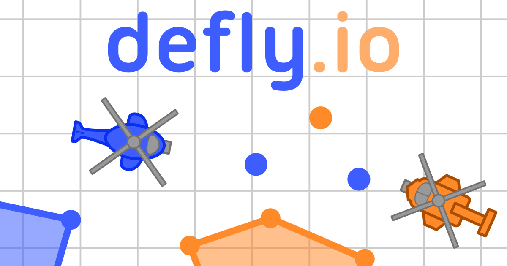

hey

Today ill be making a bot for a game ive loved playing for about 2 years now called Defly (https://defly.io/).

It's a game that takes around 5-45 minutes to play, and involves piloting a heloicopter around a 2D surface, placing dots of your color on the map, trying to connect them in a continuous line to create land within the connected dots that is yours. Movement around the map is prevented by others players dots, which you can shoot to destroy.

The reason i'm making a bot for this game is that though it is rewarding, it is also tedious to execute lower level strategies, and ive become more interested in playing the meta-game, which would require control of multiple heliocopters at once. There is a FFA and TEAM mode in this game. I will start with FFA mode to get the basic controls down, and then possibly switch to TEAM mode later to coordinate helicopters.

I predict my initial coding will involve in this order:
1) Setting up Keyboard controls from within python
2) Creating a game state to be acted upon

I expect this to require some computer vision, the only one I know of is OpenCV, but I may use simpler methods than state of the art Computer Vision offers, since the visual cues in the game are fairly uniform and predictable.

3) Once this is all done, i'd be interested in using this framework to do Reinforcement Learning with the sentdex youtube tutorial (https://www.youtube.com/watch?v=yMk_XtIEzH8) as my initial guide.

To Run:

python app.py